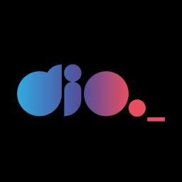

# BootcampPythonDeveloper

### Repositório para armazenar análises, estudos e implementações realizadas durante o Bootcamp Python Developer da Suzano em conjunto da DIO, buscando mais conhecimento na área e também contato com outros Devs com intuito de realizar networking e colaboração em novos desafios.

## Linguagens

 
## Plataformas

 
## IDEs

 
## Responsáveis

` `
` `

